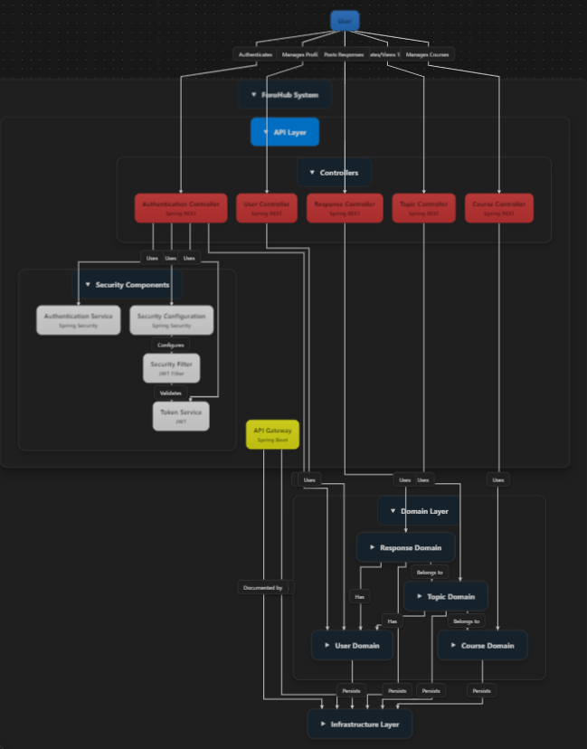

# ForoHub System

ForoHub es una plataforma desarrollada con Spring Boot que permite crear, gestionar y participar en foros educativos. Este proyecto ofrece un sistema seguro y eficiente para manejar usuarios, temas, cursos y respuestas.

---

## **Tabla de Contenidos**
1. [Características](#características)
2. [Arquitectura del Sistema](#arquitectura-del-sistema)
3. [Tecnologías Utilizadas](#tecnologías-utilizadas)
4. [Configuración e Instalación](#configuración-e-instalación)
5. [Endpoints Principales](#endpoints-principales)
6. [Contribución](#contribución)
7. [Licencia](#licencia)

---

## **Características**
- **Gestión de Usuarios**: Incluye autenticación y autorización mediante JWT.
- **Gestión de Foros**: Permite crear, visualizar y responder temas.
- **Gestión de Cursos**: Relaciona cursos con categorías y temas educativos.
- **Documentación de la API**: Generada automáticamente con Swagger.
- **Seguridad**: Integración de roles y permisos usando Spring Security.

---

## **Arquitectura del Sistema**
El diseño se basa en una arquitectura por capas:
- **Capa API**: Contiene controladores REST y configuraciones de seguridad.
- **Capa de Dominio**: Gestiona entidades, repositorios y DTOs.
- **Capa de Infraestructura**: Maneja configuraciones de base de datos, errores y documentación de API.



---

## **Tecnologías Utilizadas**
- **Lenguaje**: Java 17
- **Framework Principal**: Spring Boot
- **Seguridad**: Spring Security y JWT
- **Acceso a Datos**: Spring Data JPA y Hibernate
- **Base de Datos**: MySQL
- **Documentación**: SpringDoc OpenAPI (Swagger)

---

## **Configuración e Instalación**

### **Prerrequisitos**
- JDK 17
- Maven 3.8+
- MySQL 8.0+

### **Pasos**
1. Clonar el repositorio:

```bash
git clone https://github.com/castleortiz1/Challenge-ForoHub-AluraLatam
cd forohub
```

2. Configurar la base de datos:
   - Crear una base de datos en MySQL.
   - Actualizar las credenciales en el archivo `application.properties`:

```properties
spring.datasource.url=jdbc:mysql://localhost:3306/forohub
spring.datasource.username=tu_usuario
spring.datasource.password=tu_contraseña
```

3. Compilar y ejecutar la aplicación:

```bash
mvn clean install
mvn spring-boot:run
```

4. Acceder a la documentación de la API en:
[http://localhost:8080/swagger-ui.html](http://localhost:8080/swagger-ui.html)

---

## **Endpoints Principales**

| Método | Endpoint                  | Descripción                            |
|--------|---------------------------|----------------------------------------|
| POST   | /auth/login               | Autenticar un usuario.                 |
| GET    | /users                    | Obtener la lista de usuarios.          |
| GET    | /topics                   | Listar todos los temas.                |
| POST   | /topics                   | Crear un nuevo tema.                   |
| GET    | /courses                  | Listar todos los cursos.               |
| POST   | /responses                | Publicar una respuesta en un tema.     |

---

## **Contribución**
¡Tus contribuciones son bienvenidas! Sigue estos pasos para colaborar:
1. Haz un fork del repositorio.
2. Crea una nueva rama:

```bash
git checkout -b feature/nueva-funcionalidad
```

3. Realiza los cambios y haz un commit:

```bash
git commit -m "Añadida nueva funcionalidad"
```

4. Sube tus cambios:

```bash
git push origin feature/nueva-funcionalidad
```

5. Abre un pull request en el repositorio principal.

---

## **Licencia**
Este proyecto está bajo la Licencia MIT. Consulta el archivo `LICENSE` para más detalles.

---

¡Gracias por usar ForoHub! Si tienes preguntas o sugerencias, no dudes en abrir un issue o contactarnos directamente.
